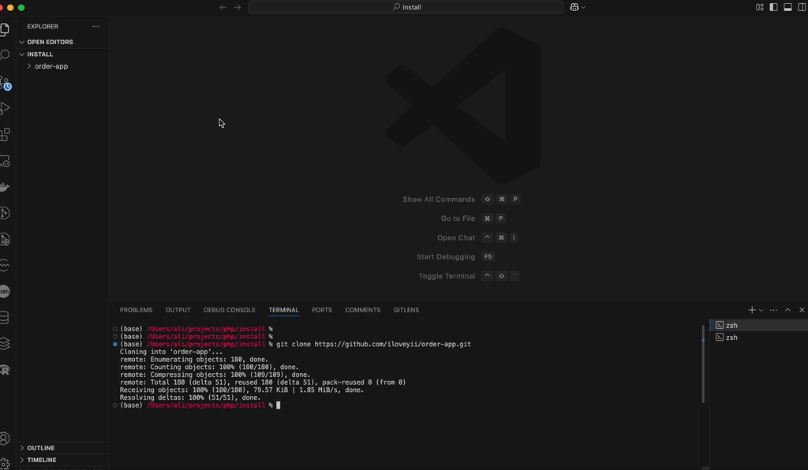

## Order App

* A simple dockerized app
* The order received is saved in db after validation & a request is made to a subscription API async

## Run

* Copy env file as `cp .env.example .env`
* Run the app as: `docker compose up -d` and wait for a while the first time
* Browse to `http://localhost`
* To create an order open the file `test/api.rest` in vscode with plugin `REST Client by Huachao Mao` installed and click `Send Request` just below the comment line at the top
* Optionally browse to `http://localhost:8095/` to see database using PhpMyAdmin

## Development

* Run `docker compose exec laravel.test php artisan make:controller OrderController`
* Run `docker compose exec laravel.test php artisan make:Model Order -m`
* Run `docker compose exec laravel.test php artisan make:Model OrderItems -m`
* Run `docker compose exec laravel.test php artisan migrate`
* Run to make job `docker compose exec laravel.test php artisan make:job SendSubscriptionJob`
* Run the queue worker & see log at storage/logs `docker compose exec laravel.test php artisan queue:work`
